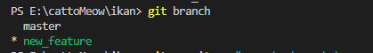

# Day 2 GIT Praktikum

## 1. Membuat Repository Baru

## 2. Mengubah _working directory_ menjadi _staging area_

## 3 Menghubungkan file dari repository cloud ke local file.

## 4 Memeriksa status

## 5 Git Commit

## 6. Git Push

## 7 Git Fetch

## 8. Git Pull

## 9. Git branch

## 10. Git merge

## 11. Git stash

