# Praktek Menggunakan PostgreSQL

# 1. Membuat Tabel

- customers
  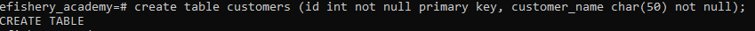
- products
  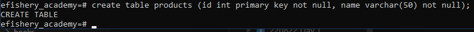
- orders
  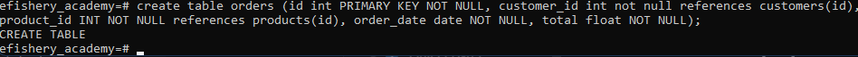

# 2. Insert

- customers
  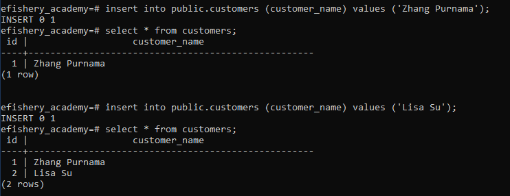
- products
  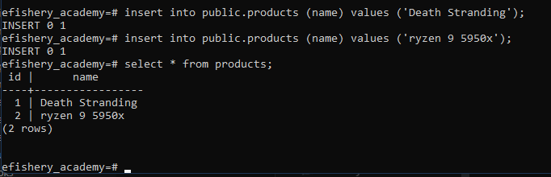
- orders
  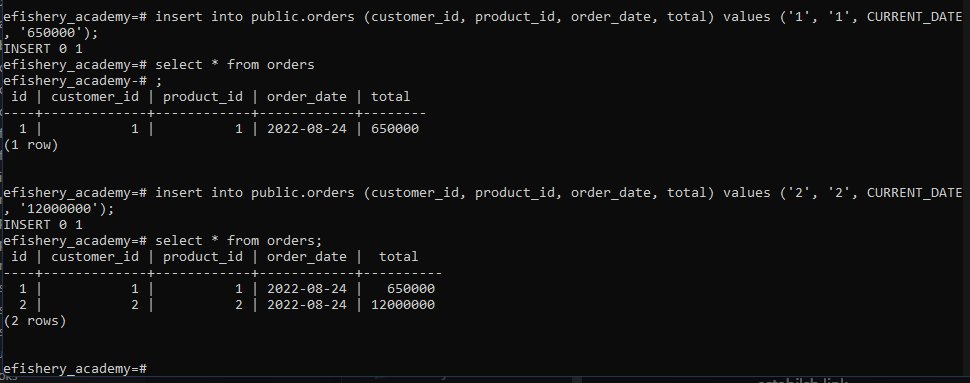

# 3. Update

- customers
  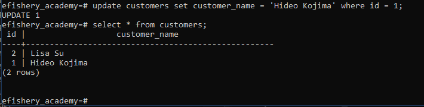
- products
  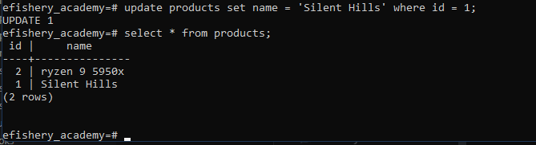
- orders
  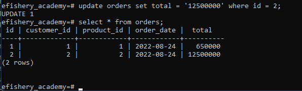

# 3. Delete

- customers
  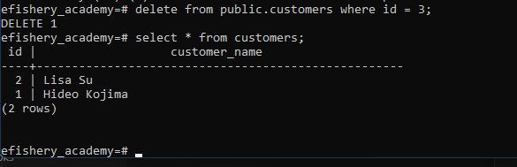
- products
  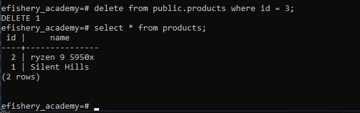
- orders
  

# 4. Joins

- Join
  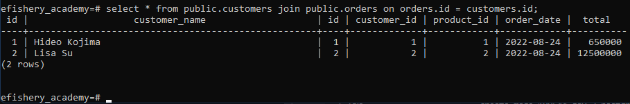
