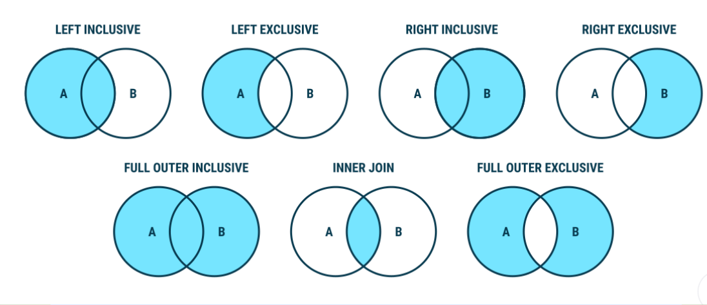

# Day 3: PostgreSQL

Pada hari ketiga saya mendapatkan ilmu berupa praktek menggunakan PostgreSQL. PostgreSQL sendiri Merupakan jenis DBMS relasional, serupa dengan MySQL dan Oracle. Database relational sendiri memiliki informasi berupa tabel, baris, dan kolom. Memiliki kemampuan untuk saling berelasi antar tabel dengan melakukan operasi `join`. Dengan ini kita semakin mudah untuk memahami hubungan antar tabel.

## DDL (Data Definition Language)

DDL digunakan untuk mendefinisikan struktur seperti skema, database, tabel, constrait, et cetera. Contoh dari statement DDL adalah `create`, `drop`, dan `alter`.

### Contoh

#### create

```
create database database_name;
```

#### alter

```
alter table table_name
    rename to table_name_chane;
```

#### drop

```
drop table table_name;
```

## DML (Data Manipulation Language)

DIgunakan untuk memanipulasi data. Contoh statementnya adalah `insert`, `update`, dan `delete`.

### Contoh

#### Insert

```
INSERT INTO public.table_name (name, age)
VALUE ('cattoMeow', '3');
```

#### update

```
UDPATE public.table_name
SET age = 4
WHERE id = 1;
```

#### delete

```
DELETE
FROM public.table_name
WHERE id = 1;
```

## Join

Statement join sendiri digunakan untuk menggabungkan data atau kolom dari satu tabel (self-join) atau lebih. Field yang umum adalah `Primary Key` dari tabel pertama dan `Foreign Key` untuk tabel lainnya.

### Macam-macam Join.



## Aggregation

Fungsi sebuah aggregation memproduksi sebuah hasil untuk seluruh grup maupun tabel.
Fungsi ini digunakan untuk merangkum hasil. Beroperasi dengan satu set kolom. Agregasi juga mereturn hasil berdasarkan grup kolom. By default, semua kolom dalam tabel diperlakukan sebagai satu grup. Klausa GROUP BY digunakan untuk membagi kolom untuk beberapa grup lagi.

### Contoh Aggregation

| Nama Fungsi | Deskripsi                                                                |
| ----------- | ------------------------------------------------------------------------ |
| COUNT       | This function returns the number or rows or non NULL values for a column |
| SUM         | This function returns the sum of a selected column.                      |
| MAX         | This function returns the largest value of a specific column.            |
| MIN         | This function returns the smallest value of a specific column.           |
| AVG         | This function returns the average value for a specific column.           |

[Lebih Lanjut](https://www.postgresql.org/docs/9.5/functions-aggregate.html)

## Subquery

Merupakan nested SQL query yang ada dalam larger query

### Contoh

```
update product set stock = subquery.stock -2 from (select id, stock from product where product.id=5) as subquery where product.id=5;
```

## Function

Dikenal sebagai stored proscedure, mengizinkan pengguna untuk membawa semua operasi yang normalnya membutuhkan beberapa query dalam satu fungsi dalam database.

### Contoh

```
create FUNCTION kurangi_stock(INT, INT) RETURNS product AS
'update product set stock = subquery.stock - $2 from (select id, stock from product where product.id = $1) as subquery where product.id = $1; select * from product where product.id=$1' LANGUAGE 'sql';
```
