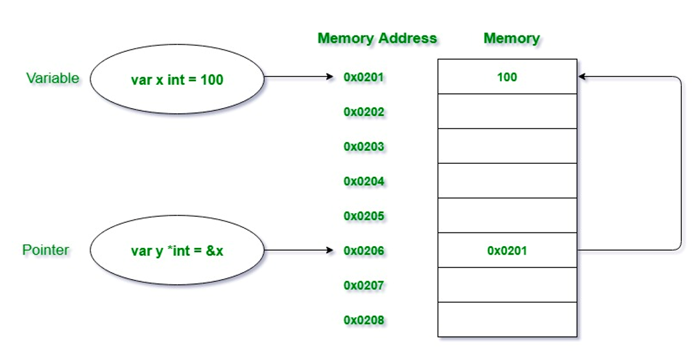

# Day 5 - Advanced Golang

## Pointer

Pointer pada Golang merupakan variabel yang digunakan untuk menyimpan alamat memori dari variabel lain. Pointer pada golang juga disebut sebagai variabel spesial (Special variable). Variabel-variabelnya digunakan untuk menyimpan sebagian data pada alamat memori di sistem.

Contoh code

```
package main
import "fmt"

func main(){

   //taking a normal variable
   var x int = 5748

   // deklarasi pointer
   var p *int

   // inisiasi pointer
   p = &x

   //menampilkan hasil
   fmt.Println("Value stored in x = ", x)
   fmt.Println("address of x = ", &x)
   fmt.Println("Value stored in variable p = ", p)
}
```

### mengubah nilai menggunakan pointer

```
var numberA int = 4
var numberB *int = &numberA

fmt.Println("numberA (value)    :", numberA)
fmt.Println("numberA (address)    :", &numberA)
fmt.Println("numberB (value)    :", numberB)
fmt.Println("numberB (address)    :", &numberB)

fmt.Println("")

numberA = 5

fmt.Println("numberA (value)    :", numberA)
fmt.Println("numberA (address)    :", &numberA)
fmt.Println("numberB (value)    :", numberB)
fmt.Println("numberB (address)    :", &numberB)

```

## Method

Method pada Go serupa dengan fungsi Go dengan satu perbedaan, yaitu, method tersebut mengandung sebuah _argument receiver_ didalamnya. Dengan bantuan _argument receiver_ tersebut, method dapat mengakses properti dari _receiver_

### define method

```
package main

import "fmt"
import "strings"

type student struct {
    name    string
    grade   int
}

func (s student) sayHello() { //sayHello merupakan fungsi private (huruf kecil di awal kalimat)
    fmt.Println("halo", s.name)
}

func (s student) getNameAt(i int) string {
    return strings.Split(s.name, " ") [i-1]
}
```

### call method

```
func main(){
    var s1 = student{"Zhang Purnama", 21}
    s1.sayHello()

    var name = s1.getNameAt(2)
    fmt.Println("nama panggilan: ", name)
}
```

### method dengan pointer

```
func (s *student) changeName(name string){
    fmt.Println("---> on changeName2, name changed to", name)
    s.name = name
}

func main(){
    var s1 = student {"Zhang Purnama", 21}
    s1.sayHello()

    s1.changeName("Hideo Kojima")
    fmt.Println("s1 after changeName", s1.name)
}
```

## Public and Private Property Method

Untuk membuat Public Property method, diperlukan nama fungsi dengan huruf besar pada awal kalimat, contohnya: SayHello. Sedangkan untuk private public property method, gunakan huruf kecil pada awal kalimat, contoh: sayHello

| Public     | Private    |
| ---------- | ---------- |
| SayHello() | sayHello() |

### Buat library

library.go

```
package library

import "fmt"

func SayHello(){
    fmt.Println("hello")
}
func sayHello(name string){
    fmt.Println("nama saya", name)
}
```

### memanggil fungsi

main.go

```
package main

import "eFishery-Day5/library

func main(){
    library.SayHello()
    library.sayhello("Zhang purnama") //kode ini akan error karena memanggil private prop method
}
```

## Interface

Merupakan _custom type_ yang digunakan untuk satu set method spesifik dan interface merupakan abstraknya, sehingga kita tidak diizinkan untuk membuat instance dari sebuah interface.

### Define interface

```
package main
import "fmt"
import "math"

type hitung interface {
    luas() float64
    keliling() float64
}
```

### membuat method

```
type lingkaran struct {
    diameter float64
}
type (l lingkaran) jariJari() float64 {
    return l.diamater / 2
}

func (l lingkaran) luas() float64{
    return math.Pi * math.Pow(l.jariJari(), 2)
}

func (l lingkaran) keliling() float64{
    return math.Pi * l.diameter
}

type persegi struct{
    sisi flot64
}

func (p persegi) luas() float64{
    return math.Pow(p.sisi, 2)
}

func (p persegi) keliling() float64{
    return p.sisi * 4
}
```

memanggil fungsi menuju main

```
func main(){
    var bangunDatar hitung

    bangunDatar = persegi{10.0}
    fmt.Println("==== persegi")
    fmt.Println("luas   :", bangunDatar.luas())
    fmt.Println("keliling   :", bangunDatar.keliling())

    bangunDatar = lingkaran{14.0}
    fmt.Println("==== lingkaran")
    fmt.Println("luas   :", bangunDatar.luas())
    fmt.Println("keliling   :", bangunDatar.keliling())
    fmt.Println("jaro-jari   :", bangunDatar.(lingkaran).jariJari())
}
```

## GoRoutine

Merupakan salah satu bagian concurrent terpenting dalam Golang. Satu hal yang membuatnya spesial adalah mampu mengeksekusi dengan prosesor multi-core. Sehingga dapat mementukan berapa core yang aktif, semakin banyak semakin kencang. Go routine juga sangat ringan, hanya berukuran 2KB.
GO Routine dapat diimplementasikan bersamaan dengan WaitGroup.

### Implementasi GoRoutine

```
package main
import(
    "fmt"
    "time"
)

func numbers(){
    for i := 1; i <= 5; i++ {
        time.Sleep(250 * time.Milisecond)
        fmt.Printf("%d ", i)
    }
}

func alphabets(){
    for i := 'a'; i <= 'e'; i++{
        time.Sleep(400 * time.Milisecond)
        fmt.Printf("%c ", i)
    }
}

func main(){
    go numbers()
    go alphabets()
    time.Sleep(3000 * time.Milisecond)
    fmt.Println("Main terminated")
}
```

### Implementasi dengan WaitGroup

```
package main

import(
    "fmt"
    "sync"
)

func main(){

    wg := sync.WaitGroup{}

    wg.Add(2)

    go func(){
        defer wg.Done()
        fmt.Println("hallo")
    }()
    go func(){
        defer wg.Done()
        fmt.Println("World")
    }()
    go func(){
        defer wg.Done()
        fmt.Println("Hideo Kojima")
    }()

    wg.Wait()
}
```
