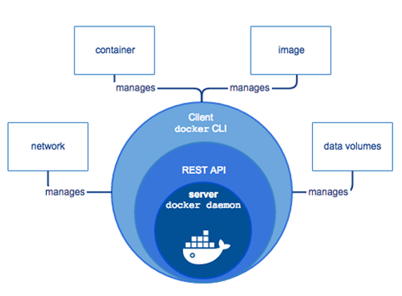
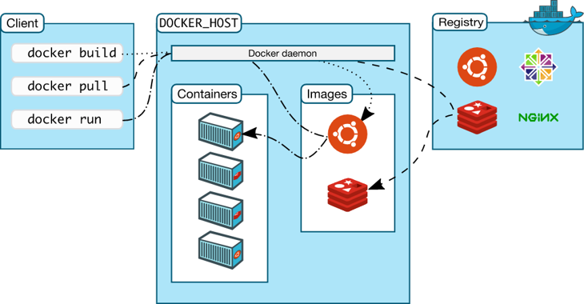
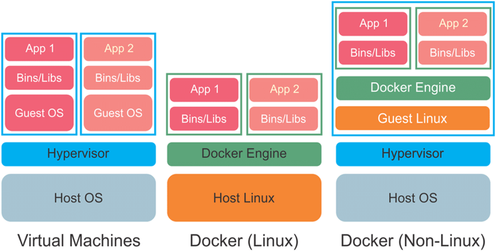

# Day 9: Containerization

Menurut IBM, Containerization adalah pengemasan kode perangkat lunak hanya dengan pustaka sistem operasi (OS) dan dependensi yang diperlukan untuk menjalankan kode untuk membuat satu executable ringan — disebut container — yang berjalan secara konsisten pada infrastruktur apa pun. Lebih portabel dan hemat sumber daya daripada mesin virtual (VM), container telah menjadi unit komputasi de facto dari aplikasi cloud-native modern.

Software containerization yang akan kita gunakan adalah Docker. Docker adalah aplikasi populer yang dapat menampung aplikasi kita. Analogi containerization seperti rumah. Rumah berisi banyak kamar, termasuk kamar tidur 1, kamar tidur 2, kamar tidur 3, dan lemari dan dapur. Kamar tidur 1-3 adalah aplikasi perangkat lunak, sedangkan lemari dan dapur adalah kerangka kerja.

## Arsitektur Docker

Docker menggunakan arsitektur client-server

## Cara kerja docker

